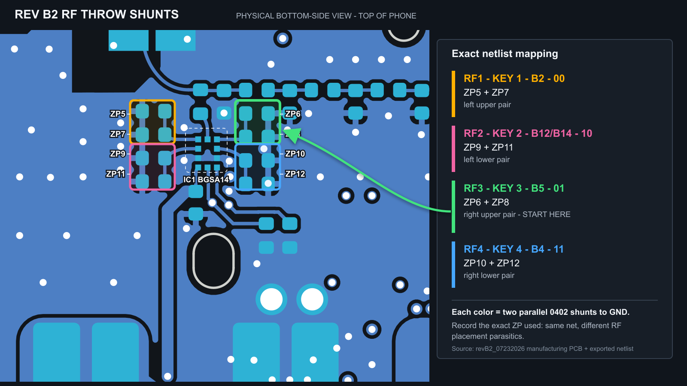

# Dynamic antenna tuning tool

Standalone Rev B2 bench firmware for manually selecting the four BGSA14 RF
throws through Telit GPIO2/GPIO3. It is not linked into production firmware.

## Build and flash

The tuner is a bench artifact behind the diagnostics option, so enable it
at configure time:

```sh
cmake -B build -DSISU_BUILD_DIAGNOSTICS=ON
cmake --build build --target tune_dynamic_ant -j4
picotool load -f -v -x build/tools/tune_dynamic_ant/tune_dynamic_ant.uf2
```

## Controls

- Press Power to start the modem and tool.
- Hold Power for one second for qualified shutdown.
- Press `1` through `4` to select the corresponding physical RF throw.
- CDC commands: `status`, `power on`, `power off`, and `select 1..4`.

| Key | Throw | Tuning-screen anchor | `GPIO3:GPIO2` | Shunt footprints |
|---:|---:|---|---:|---|
| 1 | RF1 | B2 | `00` | ZP5, ZP7 |
| 2 | RF2 | B12/B14 | `10` | ZP9, ZP11 |
| 3 | RF3 | B5 | `01` | ZP6, ZP8 |
| 4 | RF4 | B4 | `11` | ZP10, ZP12 |

These labels identify the anchors used while tuning, not the final automatic
band policy. The production groups and capability-intersected `#STUNEANT`
masks are defined beside their static assertions in
`src/services/modem_vendor_telit_tune.c`. In that final policy LTE B14 belongs to
RF3 rather than the RF2 anchor label.

Each pair contains two parallel 0402 shunt positions from that switch throw to
GND. Record the exact footprint populated because its physical placement has
different RF parasitics even though both footprints share a net.



## Safety behavior

The tool requires an exact `+CFUN: 4` readback before it permits manual branch
selection. GPIO writes are non-persistent (`<save>=0`) and read back after each
selection. If `AT#STUNEANT?` reports enabled, the tool fails closed instead of
altering an existing NVM tuning table.

On shutdown it releases GPIO2/GPIO3, sends `AT#SHDN`, qualifies PWRMON low for
500 ms, and only then removes +3V8. It never uses GP39 emergency shutdown as an
automatic recovery action and never cuts the rail while PWRMON remains high.

The module can briefly be RF-active before its AT channel is ready and
`CFUN=4` is confirmed. Keep a safe RF termination or test setup connected until
the display reports `READY` and `RADIO: OFF`.
